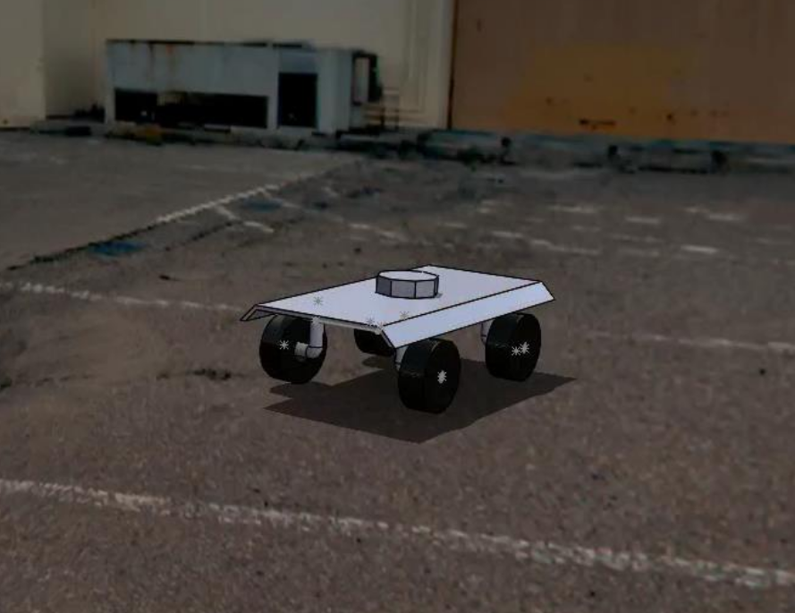
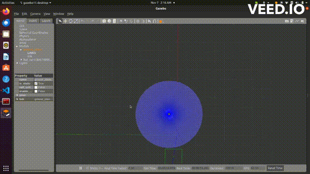
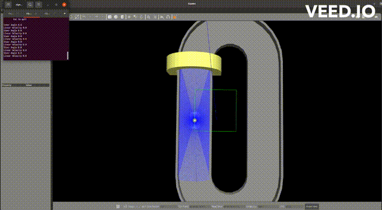

# Bot Car Project

This README provides instructions on how to set up and run the different components of the Bot Car project. This includes visualizations with Rviz, simulations with Gazebo, debugging tools, and running the car in a competition map.

## Prerequisites

Ensure that you have the following dependencies installed:

- ROS 2 (Refer to the [ROS 2 installation guide](https://docs.ros.org/en/foxy/Installation.html))
- Gazebo (Follow the [Gazebo installation instructions](http://gazebosim.org/tutorials?tut=install_ubuntu))
- Python 3
- Colcon build system (`sudo apt install python3-colcon-common-extensions`)
- xacro
- math


NOTE : We have 2 packages, one that imports and loads the toy car into the gazebo (cmake dependency)
and the other to subscribe and publish to the topic to move the car in gazebo (python dependency).

## SOLIDWORKS DESIGN

### TOY CAR

<p align="center">

</p>


## Setup

1. **Building the Packages**
   To build the ROS packages, use the following command:

    ```bash
    colcon build
    ```
Put both the packages in the same workspace and run the above command in the root directory.
## Usage

After building the packages, you can use the following commands to run various aspects of the project.
Running the Simulations

Once the project is built, you can execute various parts of the project as follows:
Visualization with Rviz

```bash

ros2 launch bot_car display.launch.py
```

This command initializes an Rviz session to visualize the robot's model and sensor data.
Simulation with Gazebo

```bash

ros2 launch bot_car gazebo.launch.py
```

Use this command to start the Gazebo simulator with the robot loaded into the environment.
Debugging

```bash

ros2 launch bot_car debug.launch.py
```

For debugging purposes, this command will run both the Gazebo simulator and an Rviz session concurrently.
Competition Mode

To start the robot in a competition map with teleoperation enabled:

 Run the competition launch file:

```bash

ros2 launch bot_car competition.launch.py
```
In a new terminal, navigate to the scripts directory within your ROS workspace and execute the teleoperation script:

``` cd <path_to_your_ros_workspace>/src/bot_car/scripts./teleop.py ```

Proportional Controller: To execute the proportional controller:
Start the Gazebo environment with:

```
ros2 launch bot_car gazebo.launch.py
```

Open a new terminal and run the publisher:

```bash

ros2 run py_pub pub
```

In another terminal and start the subscriber:

```bash

    ros2 run py_pub sub

```

Note- Remember to source your ROS 2 environment in each terminal session:

```bash
source /opt/ros/<ros2_distro>/setup.bash
```

Replace <ros2_distro> with your specific ROS 2 distribution (e.g., foxy, galactic) and <path_to_your_ros_workspace> with the actual path to your workspace.


## RESULTS

### PROPORTIONAL CONTROLLER

<p align="center">

</p>
Full video - Videos/proportional_controller.webm

### TELEOP ON COMPETITION ARENA
<p align="center">

</p>
Full video - Videos/teleop.mp4
